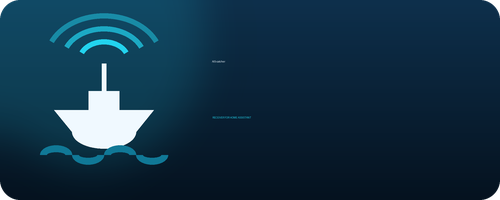

# AIS-catcher Home Assistant Add-ons

Home Assistant add-on repository for [AIS-catcher](https://github.com/jvde-github/AIS-catcher).

Two add-ons that work together, or on their own:

- **AIS-catcher Receiver** runs AIS-catcher on the Home Assistant machine
  itself, with the SDR plugged into it.
- **AIS-catcher Statistics** turns any running AIS-catcher — the add-on above,
  or a receiver elsewhere on the network — into Home Assistant entities.
- **AIS-catcher Receiver (Edge)** is the same receiver built against
  AIS-catcher's rolling `Edge` build, for the managed mode that no tagged
  release contains yet.

If the SDR is on the Home Assistant machine, install both. If AIS-catcher
already runs on a Raspberry Pi in the attic, install Statistics only.

## Installation

Click the button below to open the "Add add-on repository" dialog on your own
Home Assistant instance:

[](https://my.home-assistant.io/redirect/supervisor_add_addon_repository/?repository_url=https%3A%2F%2Fgithub.com%2Fnanamitm%2FAIS-catcher-HA)

If the button does not work, add the repository by hand:

1. Open **Settings → Add-ons → Add-on store** in Home Assistant.
2. Select the three dots in the top right and choose **Repositories**.
3. Enter `https://github.com/nanamitm/AIS-catcher-HA` and select **Add**, then
   close the dialog.
4. Reload the page and scroll down to the **AIS-catcher Home Assistant Add-ons**
   section, or search for "AIS-catcher".
5. Select the add-on you want and select **Install**. The image is built on
   your device, which takes a few minutes on a Raspberry Pi or Home Assistant
   Yellow.
6. Open the **Configuration** tab and start the add-on. **Receiver** needs
   nothing configured — it opens a setup wizard in the sidebar. **Statistics**
   needs `url` set to your AIS-catcher web server, for example
   `http://192.168.1.10:8100`.

### Prerequisites

- Home Assistant **OS** or **Supervised**. Add-ons are not available on Home
  Assistant Container.
- For **Receiver**: a supported SDR connected to the Home Assistant machine —
  RTL-SDR, AirSpy, HackRF, HydraSDR, or a serial receiver such as a dAISy.
  SDRplay is not supported. Architectures: `aarch64` and `amd64`.
- For **Statistics**: the
  [Mosquitto broker](https://github.com/home-assistant/addons/tree/master/mosquitto)
  add-on and the MQTT integration. The credentials are picked up from the
  Supervisor automatically, so nothing has to be typed in. And a running
  AIS-catcher with its web server enabled, reachable from Home Assistant:
  `http://<host>:8100/api/stat.json` must return JSON — which is exactly what
  the Receiver add-on provides.

## Add-ons

### [AIS-catcher Receiver](./ais_catcher)



Runs AIS-catcher itself, with the SDR plugged into the Home Assistant machine —
no second computer next to the antenna.

The configuration lives in the add-on options: device, gain, sample rate,
frequency correction, station name and position, community feed sharing key and
UDP targets, plus `extra_args` for everything AIS-catcher accepts and this
add-on does not name. The AIS-catcher web viewer lands in the Home Assistant
sidebar through ingress.

There is also a `mode: managed`, which hands all of that to AIS-catcher's own
dashboard — configured from the browser, stored in a file the program
maintains, reached on port 8118 of the host under a password of its own. It is
newer than the AIS-catcher release this add-on installs, so it needs
`AIS_CATCHER_VERSION` raised in `build.yaml` first; the add-on checks and says
so rather than failing obscurely.

The web viewer is published on port 8100 for the rest of the network and for
OpenCPN. The Statistics add-on does not need that port at all — it reaches the
receiver by add-on name, `http://eb24ddf7-ais-catcher:8100`.

It is built from the upstream release package rather than from source, so
installing it downloads a few megabytes instead of compiling for a quarter of
an hour.

See [the documentation](./ais_catcher/DOCS.md) for the options.

### [AIS-catcher Receiver (Edge)](./ais_catcher_edge)

The Receiver add-on built against AIS-catcher's rolling `Edge` build instead of
a tagged release, which is the only way to get **managed mode** — AIS-catcher
configuring itself from its own dashboard — until upstream tags a release that
contains it. Managed mode is the default here.

The trade is real: `Edge` is rebuilt from `main` and published to the same
download URL, so every rebuild can install a different program, two people
installing on different days do not get the same one, and an upstream mistake
reaches you without anything changing in this repository. Install the stable
Receiver unless you want managed mode; this add-on goes away once a tagged
release has it.

Everything but the pinned version and a handful of manifest lines is generated
from the stable add-on by `tools/sync_edge.py`, so the two cannot drift.

### [AIS-catcher Statistics](./ais_catcher_stats)


Polls the `stat.json` endpoint of an existing AIS-catcher web server and
publishes the statistics to Home Assistant over MQTT discovery — around 40
entities, all grouped under **one device**: message rate, vessel counts, range,
signal levels, PPM, per-channel and per-message-type breakdowns, reception
coverage per compass sector, plus diagnostics such as memory use, received
bytes, uptime and version. The receiver itself lands on the map.

It answers "is anything close?" out of the box, with sensors for the nearest
vessel and the number of ships within a radius you choose.

Optionally it also tracks individual ships: list the MMSIs you care about and
each becomes its own device with a map tracker, an in-range flag, speed,
course, distance, navigation status, destination, ETA and hull dimensions.

The AIS-catcher map itself lands in the Home Assistant sidebar through ingress,
behind your Home Assistant login — so it also works from outside the house
without exposing the receiver.

It is a bridge only — it does not run AIS-catcher itself, so it works both with
the Receiver add-on above and with a receiver running elsewhere on the network.

This is the add-on version of the `rest:` + `template:` YAML posted in
[AIS-catcher issue #376](https://github.com/jvde-github/AIS-catcher/issues/376),
without the YAML and without the "all sensors ended up outside a device"
problem.

See [the documentation](./ais_catcher_stats/DOCS.md) for the options.

## Repository layout

```
repository.yaml              add-on repository manifest
ais_catcher/                 the receiver add-on
├── config.yaml              manifest: usb/udev/uart, the published web port
├── build.yaml               Debian base images, and the AIS-catcher version
├── Dockerfile               installs the upstream release .deb
├── run.sh                   managed mode, or a command line built from options
├── nginx.conf               ingress proxy for the dashboard / web viewer
├── translations/en.yaml     option labels shown in the add-on UI
├── icon.png / logo.png      store artwork
├── DOCS.md                  the add-on documentation tab
└── CHANGELOG.md
ais_catcher_edge/            generated from ais_catcher/ by tools/sync_edge.py
ais_catcher_stats/           the statistics add-on
├── config.yaml              manifest: options, schema, services: mqtt:want
├── build.yaml               base images per architecture
├── Dockerfile
├── run.sh                   bashio: options + Supervisor MQTT credentials
├── bridge.py                polling, normalisation, MQTT discovery, publishing
├── sensors.py               entity table - add a row to add a sensor
├── nginx.conf               ingress proxy for the receiver's web UI
├── translations/en.yaml     option labels shown in the add-on UI
├── icon.png / logo.png      store artwork
├── DOCS.md                  the add-on documentation tab
└── CHANGELOG.md
tests/test_bridge.py         offline test of normalisation and discovery
tests/test_run_args.sh       offline test of the receiver's command line
tools/make_icons.py          regenerates the artwork for both add-ons
tools/sync_edge.py           regenerates ais_catcher_edge/ (--check in CI)
.github/workflows/           add-on linter, shellcheck, nginx, both tests
```

## Development

Both tests run without Home Assistant, a Supervisor, a broker or an SDR.

The bridge test stubs out MQTT and feeds a recorded `stat.json` through the
normalisation and discovery code, then renders every value template with Jinja:

```bash
pip install -r tests/requirements.txt && python tests/test_bridge.py
```

The receiver test stubs out bashio, nginx and the `exec` at the end of
`run.sh`, so it can assert on the exact AIS-catcher command line a given set of
options produces:

```bash
bash tests/test_run_args.sh
```

Regenerate the artwork for both add-ons after changing `tools/make_icons.py`:

```bash
pip install -r tools/requirements.txt && python tools/make_icons.py
```

To test a change on a real system, copy the add-on folder to `/addons/` on the
Home Assistant host (Samba or SSH add-on), then **Add-on store → ⋮ → Check for
updates**, and use **⋮ → Rebuild** on the add-on after each change. Keep
`run.sh` LF-terminated — `.gitattributes` enforces this.

The Edge add-on is generated. Change `ais_catcher/`, then:

```bash
python tools/sync_edge.py
```

CI fails if the two are out of step, and the script refuses to run — naming the
rule to fix — when a change moves text it rewrites.

To move the receiver to a newer AIS-catcher, change `AIS_CATCHER_VERSION` in
`ais_catcher/build.yaml` to a tag that has
`ais-catcher_debian_bookworm_{amd64,arm64}.deb` among its
[release assets](https://github.com/jvde-github/AIS-catcher/releases), and
rebuild.

## License

MIT — see [LICENSE](./LICENSE).
